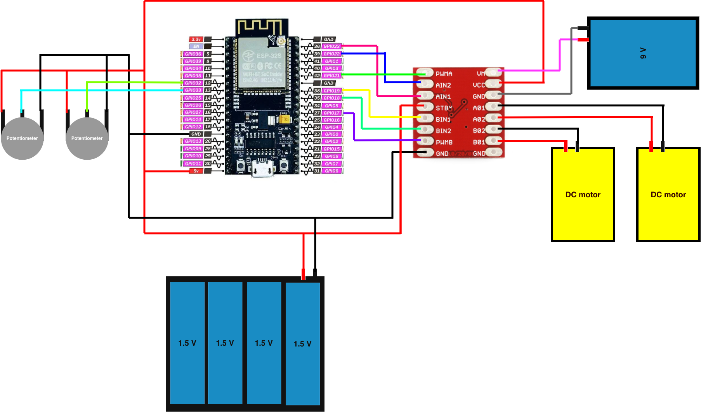
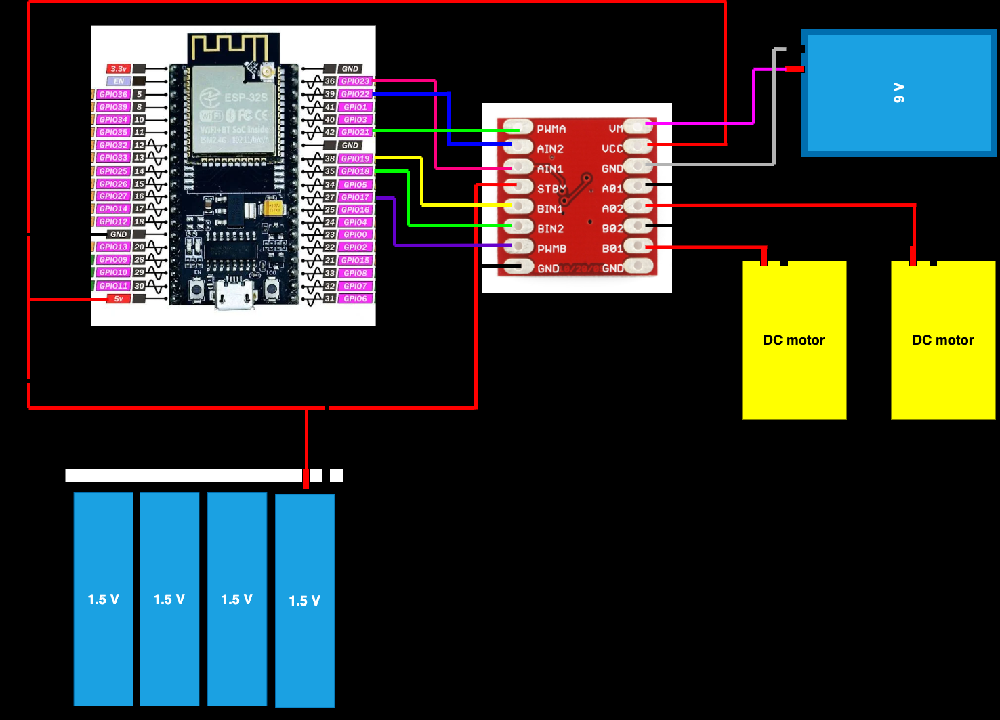

# ESP32 TB6612FNG Motor Controller

This project demonstrates two methods of controlling 2 DC motors using an ESP32 and a TB6612FNG motor driver.

## Hardware

- ESP32
- TB6612FNG motor driver
- 2 x DC motors
- 2 x Potentiometers
- 9V battery

## Project 1 - potentiometer controller

[Click me for code](code/potentiometer_controller.cpp)

This project controls the motor speed using potentiometers.
Each potentiometer controls 1 DC motor.
The potentiometer position determines:

- Motor speed
- Motor direction
- At center position motor stop

### Wiring 1

## Project 2 - Wifi controller

[Click me for code](code/wifi_controller.cpp)

This project controls the motor direction and speed using wifi.
The ESP32 creates its own Wi-Fi Access Point and hosts a web interface for controlling the motors.

- SSID = ESP32-Car
- Password = 12345678

After connect to wifi open: http://192.168.4.1

### Wiring 2

## License

This project is provided for educational purposes.